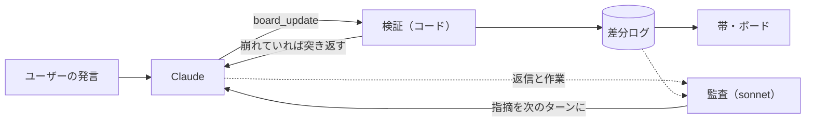

# claude-code-discourse-state

Claude Code の mod。Claude がユーザーの意図をどう読んでいるかを、作業ごとに画面に出す。

エージェントの意図の読みは、ふつう成果物を見るまで分からない。この mod では、Claude 本人が自分の読みをボードに書き、ユーザーはそれを会話の途中でいつでも見られる。読みがずれていれば、話しかけて直せる。

ボードに出すのは、作業ごとに次の3つ。

- **意図**：ユーザーの言葉と、Claude の読み。訂正されると読みが書き換わり、前の読みが残る
- **文脈の補完**：ユーザーが言っていないのに Claude が補った前提。理由つき、黄色
- **流れ**：これからの手順と、手順ごとの理由

作業は木（作業の分解）で持つ。片付いた作業は出さない。


## インストール

Claude Code 2.1.289 で動作を確認している（mod の仕組みが使える版が必要）。

```sh
git clone https://github.com/uzusio/claude-code-discourse-state
claude --plugin-dir claude-code-discourse-state/mod/discourse-state
```

## 使い方

| 操作 | |
|---|---|
| ボードを開く・閉じる | 帯のボタン、`/discourse-state`。開いているときは Esc |
| 作業をたたむ | 作業名の左の ▾ |
| 読みを直す | 「そうじゃなくて〜」と話す |

## しくみ



- **書く**：Claude 本人が、ターンの終わりに mod のツール `board_update` で差分を渡す。別のモデルが会話を外から読んで書くのではないので、ボードは Claude の理解そのものになる
- **検証**：存在しない項目への参照、理由のない補完、取り消した前提への依存の放置などをコードで弾き、ツールの結果として返す
- **監査**：ターンの終わりに別のモデルが、意図の読みそのものが外れている兆し（作業が読みと反対に進んでいる、求められたことと別のことに答えている、片付いた作業が開いたまま）だけを確かめ、次のターンの頭に Claude にだけ渡す。直すかどうかは Claude が判断する。意図を合わせる目的は Claude がユーザーの代わりに判断できるようにすることなので、監査はユーザーへの確認を増やさない
- **書き忘れ**：作業をしたのに更新しなかったターンは、帯に「ボード未更新」と出し、次のターンで Claude に促す
- **差し込まない**：ボードの中身を Claude のプロンプトに差し込むことはしない

記録はセッションごとに `<TEMP>/discourse-state/<セッション id>/` に置く。監査は作業のあったターンごとにモデルを1回呼ぶ。

## 背景

談話意味論の枠組みのうち、読みの精度に効く部分だけを使っている。会話を縛る制約（SDRT の右フロンティア制約など）は入れていない。

- **QUD**（Question Under Discussion, Roberts）：会話を議論中の問いの木として扱う。作業を問いの木として持ち、作業ごとに意図の読みを置く
- **SDRT**（Segmented Discourse Representation Theory, Asher & Lascarides）：発話どうしの関係（訂正・補足・理由・対比・条件など）。関係を更新規則に使い、補完どうしの関係のラベルにも使う
- **accommodation**（前提の補完, Lewis）：聞き手が、相手の言っていない前提を補って解釈を成り立たせること。「文脈の補完」として区別して出す

## 開発

```sh
cd poc && python -m unittest test_discourse_state            # 状態の更新規則（Python 版・仕様）
cd mod/discourse-state && claude plugin validate . && claude plugin test .
python tools/test.py                                         # 両方を回して test-results/junit.xml にまとめる
npx tsx tools/render-svg.ts                                  # README の画像を描き直す
```

`poc/` の Python 版と `mod/` の TypeScript 版が同じ結果を返すことを、共通の例（`poc/examples/`）で確かめている。例を変えたら `python poc/export_fixture.py` を実行する。README の画像は `poc/examples/self.jsonl`（この mod を作る会話を例にしたもの）から描いている。

## ライセンス

MIT
