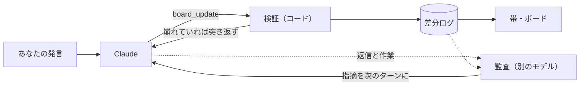

# claude-code-discourse-state

Claude Code が**あなたの意図をどう読んでいるか**を、会話しながら見られるようにする mod。

エージェントに作業を任せるとき、本当に合わせたいのは指示の字面ではなく意図です。意図さえ合っていれば、細かい手順はエージェントに任せられます。ところが、エージェントが意図をどう読んだかは、ふつう成果物ができるまで見えません。

この mod は、Claude の頭の中の「いまの理解」を画面に出します。

- **帯**：プロンプトの上に、いま扱っている作業の意図の読みと次の一歩を常に出す
- **ボード**：帯のボタンで開く。作業を木で並べ、作業ごとにあなたの言葉と Claude の意図の読み、決まったこと（関係ラベルつき）、これからの流れを出す

読みのずれに気づいたら、「そうじゃなくて〜」と話せば次のターンで直ります。ずれの原因になりやすい**文脈の補完**（あなたが言っていない前提を Claude が補ったところ）は黄色で出ます。


*ボードを閉じた状態。会話の下、プロンプトの上に帯が出る*


*ボードを開いた状態。作業の木に、作業ごとの意図と、関係ラベル付きの決まったことがぶら下がる*

## 特長

- **作業ごとの意図**：作業（とその下位の作業）ごとに、あなたの言葉と Claude の読みを並べて出す
- **関係ラベル**：決まったこと同士を「答え・補足・理由・対比・結果・条件」でつなぎ、訂正で置き換えたものは置き換え元を添える
- **流れ**：これからの手順ごとに、なぜその手順か・どの意図から出たかを出す
- **文脈の補完**：あなたが言っていない前提（範囲・順番・理由）で決めたところを黄色で出す
- **監査**：意図を読み違えている兆しを別のモデルが確かめ、Claude 自身に返す。直すかどうかは Claude が判断する
- **話して直せる**：「そうじゃなくて〜」と言えば、次のターンで読みが直る
- **非同期で使える**：帯は常に出しておき、ボードは見たいときだけ開く

## インストール

Claude Code 2.1.289 で動作を確認しています（mod の仕組みが使える版が必要）。

```sh
git clone https://github.com/uzusio/claude-code-discourse-state
claude --plugin-dir claude-code-discourse-state/mod/discourse-state
```

## 使い方

| 操作 | |
|---|---|
| ボードを開く・閉じる | 帯のボタン、または `/discourse-state`。開いているときは Esc でも閉じる |
| 読みを直す | ふつうに「そうじゃなくて〜」と話す |
| 作業をたたむ・履歴を見る | 作業の見出し、「どの作業にも付いていない決まったこと」「置き換わったこと」を押して開閉 |

## しくみ



- **書くのは Claude 本人**：読みが変わったターンの終わりに、mod のツール `board_update` で差分を渡す。別のモデルが会話を外から読んで書くのではないので、ボードは Claude の理解そのもの
- **検証**：存在しない決定の取り消し、依存の放置、理由のない補完などをコードで弾く
- **監査**：ターンの終わりに別のモデル（sonnet）が、意図の読みそのものが外れている兆しだけを確かめる。作業が意図や決まったことと反対に進んでいる、求められたことと別のことに答えている、答えの出た問いが開いたまま、の3つ。手順の順番や言葉の出どころなど、Claude の判断に任されている進め方は見ない
- 指摘はボードにも帯にも出さず、次のターンの頭に Claude にだけ渡す。直すか、そのままでよいかは Claude が判断し、あなたの判断が本当に要るときだけ問いとして開く。意図を合わせる目的は Claude があなたの代わりに判断できるようにすることなので、監査があなたへの確認を増やさないようにしている

記録はセッションごとに、ローカルの一時フォルダ（`<TEMP>/discourse-state/<セッション id>/`）に置きます。作業のあったターンごとに、監査でモデルを1〜2回呼びます。

## 背景

会話の構造を扱う談話意味論の枠組みのうち、読みの精度が上がる部分だけを使っています（会話を縛る制約、たとえば SDRT の右フロンティア制約は入れていません）。

- **QUD**（Question Under Discussion, Roberts）：会話を「いま議論している問い」の木として扱う。作業を問いの木として持ち、作業ごとに意図の読みを置く。どの発話もいまの問いに答えるはず、という関連性を、監査で返信に当てはめる
- **SDRT**（Segmented Discourse Representation Theory, Asher & Lascarides）：発話どうしの関係を扱う。関係を読みの更新規則として使う。たとえば訂正なら前の決定を取り消して置き換え、それに依存していた決定を見直す。対比（「でも」で並べるだけ）は取り消さない、理由づけ（「〜だから」）はあなたの理由としてあなたの言葉に付ける、と区別することで、取り消しすぎや理由の補いすぎを防ぐ
- **accommodation**（前提の補完, Lewis）：聞き手が、相手の言っていない前提を補って解釈を成り立たせること。読みがずれる原因になりやすいので「文脈の補完」として区別する

## 開発

```sh
cd poc && python -m unittest test_discourse_state            # 状態の更新規則（Python 版・仕様）
cd mod/discourse-state && claude plugin validate . && claude plugin test .
npx tsx tools/render-svg.ts                                  # README の画像を描き直す
```

`poc/` の Python 版と `mod/` の TypeScript 版が同じ結果を返すことを、共通の例（`poc/examples/audit_job.jsonl`）で確かめています。例を変えたら `python poc/export_fixture.py` を実行してください。README の画像は `poc/examples/self.jsonl`（この mod を作る会話の例）から描いています。

## ライセンス

MIT
