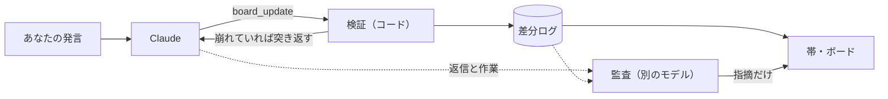

# claude-code-discourse-state

Claude Code が**あなたの意図をどう読んでいるか**を、会話しながら見られるようにする mod。


プロンプトの上に、Claude の「いまの意図の読み」と「次の一歩」が常に出ます。ボタンを押すと、読みの全体が開きます。


## 特長

- **意図の読み**：あなたの言葉と、Claude がそれをどう読んだかを並べて出す
- **流れ**：これからの手順ごとに、なぜその手順か・どの意図から出たかを出す
- **文脈の補完**：あなたが言っていない前提（範囲・順番・理由）で決めたところを黄色で出す
- **監査**：意図を読み違えている兆し（読みと作業の食い違い、聞かれたことに答えていない返信など）を赤で出す
- **話して直せる**：「そうじゃなくて〜」と言えば、次のターンで読みが直る
- **非同期で使える**：帯は常に出しておき、ボードは見たいときだけ開く

## なぜ

エージェントに作業を任せるとき、本当に合わせたいのは指示の字面ではなく意図です。意図さえ合っていれば、手順はエージェントに任せられます。でもエージェントが意図をどう読んだかは、ふつう成果物ができるまで見えません。このボードは、その読みを会話の途中でいつでも見えるようにします。

## インストール

Claude Code 2.1.289 で動作を確認しています（mod の仕組みが使える版が必要）。

```sh
git clone https://github.com/uzusio/claude-code-discourse-state
claude --plugin-dir claude-code-discourse-state/mod/discourse-state
```

## 使い方

| 操作 | |
|---|---|
| ボードを開く・閉じる | 帯のボタン、または `/discourse-state`。開いているときは Esc でも閉じる |
| 読みを直す | ふつうに「そうじゃなくて〜」と話す |
| 履歴を見る | ボードの「決まったこと」「文脈の補完」「置き換わったこと」を押して開く |

## しくみ



- **書くのは Claude 本人**：読みが変わったターンの終わりに、mod のツール `board_update` で差分を渡す。別のモデルが会話を外から読んで書くのではないので、ボードは Claude の理解そのもの
- **検証**：存在しない決定の取り消し、依存の放置、理由のない補完などをコードで弾く
- **監査**：ターンの終わりに別のモデルが確かめ、ボードは書き換えずに指摘だけを出す
  - 出どころ（haiku）：「あなたが言ったこと」として書かれた項目が、本当に発言にあるか
  - 食い違い（sonnet）：Claude の返信や作業が、Claude 自身の書いた読みと矛盾していないか
  - 問いへの答え（sonnet）：返信が、あなたがそのターンに聞いた・頼んだことに答えているか
  - 問いの閉じ方（sonnet）：答えの出た問いが開いたまま、または答えの無い問いが閉じられていないか

記録はセッションごとに、ローカルの一時フォルダ（`<TEMP>/discourse-state/<セッション id>/`）に置きます。作業のあったターンごとに、監査でモデルを1〜2回呼びます。

## 背景

会話の構造を扱う談話意味論の枠組みのうち、読みの精度が上がる部分だけを使っています（会話を縛る制約、たとえば SDRT の右フロンティア制約は入れていません）。

- **QUD**（Question Under Discussion, Roberts）：会話を「いま議論している問い」の木として扱う。意図の読みを根に、問いと決まったことを木で持つ。どの発話もいまの問いに答えるはず、という関連性を、監査で返信に当てはめる
- **SDRT**（Segmented Discourse Representation Theory, Asher & Lascarides）：発話どうしの関係を扱う。関係を読みの更新規則として使う。たとえば訂正なら前の決定を取り消して置き換え、それに依存していた決定を見直す。対比（「でも」で並べるだけ）は取り消さない、理由づけ（「〜だから」）はあなたの理由としてあなたの言葉に付ける、と区別することで、取り消しすぎや理由の補いすぎを防ぐ
- **accommodation**（前提の補完, Lewis）：聞き手が、相手の言っていない前提を補って解釈を成り立たせること。読みがずれる原因になりやすいので「文脈の補完」として区別する

## 開発

```sh
cd poc && python -m unittest test_discourse_state            # 状態の更新規則（Python 版・仕様）
cd mod/discourse-state && claude plugin validate . && claude plugin test .
npx tsx tools/render-svg.ts                                  # README の画像を描き直す
```

`poc/` の Python 版と `mod/` の TypeScript 版が同じ結果を返すことを、共通の例（`poc/examples/audit_job.jsonl`）で確かめています。例を変えたら `python poc/export_fixture.py` を実行してください。

## ライセンス

MIT
