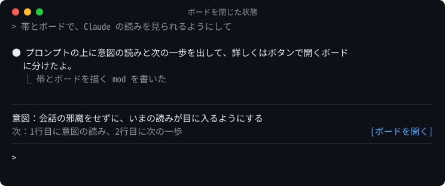
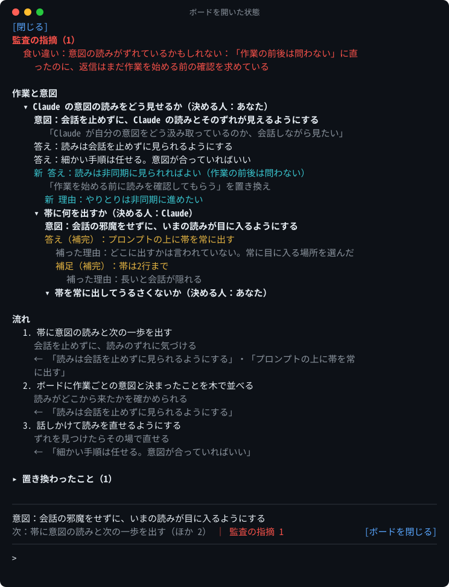
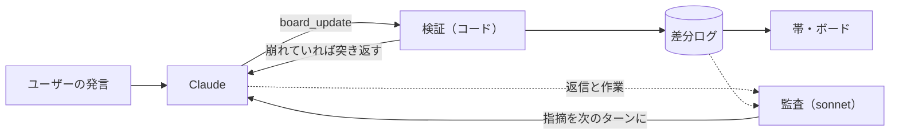

# claude-code-discourse-state

Claude Code の mod。Claude がユーザーの意図をどう読んでいるかを、作業ごとに画面に出す。

エージェントの意図の読みは、ふつう成果物を見るまで分からない。この mod では、Claude 本人が自分の読みをボードに書き、ユーザーはそれを会話の途中でいつでも見られる。読みがずれていれば、話しかけて直せる。

ボードに出すのは、作業ごとに次の3つ。

- **意図**：ユーザーの言葉と、Claude の読み。訂正されると読みが書き換わり、前の読みが残る
- **文脈の補完**：ユーザーが言っていないのに Claude が補った前提。理由つき、黄色
- **流れ**：これからの手順と、手順ごとの理由

作業は木（作業の分解）で持ち、ボードには開いている作業だけを出す。





## インストール

Claude Code 2.1.289 で動作を確認している（mod の仕組みが使える版が必要）。

意図ボードは、使いたいプロジェクトごとに入れる。入れたプロジェクトで開いたセッションでだけ読み込まれ、作業のあったターンごとに監査のモデル呼び出しが走る。

### インストールする

使いたいプロジェクトのフォルダで実行する。

```sh
claude plugin marketplace add uzusio/claude-code-discourse-state
claude plugin install discourse-state@claude-code-discourse-state --scope project
```

`--scope project` はプロジェクトの `.claude/settings.json` に書き、そのリポジトリを使う人みんなに入る。自分だけに入れるなら `--scope local`（`.claude/settings.local.json`）。

更新は `claude plugin update discourse-state@claude-code-discourse-state` のあと、`claude` を起動し直す。

帯が出ないときは、そのプロジェクトのフォルダで `claude plugin list` を実行し、`discourse-state@claude-code-discourse-state` の `Scope` と `Status` を確かめる。別のプロジェクトに入れてあるだけだと `✘ disabled` と出るので、このプロジェクトで入れ直す。

### clone して入れる

clone した mod を、使いたいプロジェクトの `.claude/skills/discourse-state` にリンクする。プロジェクトの `.claude/skills/` にあるプラグインは自動で読み込まれ、mod のファイルを保存するとホットリロードされる。

```sh
git clone https://github.com/uzusio/claude-code-discourse-state
# macOS / Linux（使いたいプロジェクトのフォルダで）
ln -s /path/to/claude-code-discourse-state/mod/discourse-state .claude/skills/discourse-state
# Windows（コマンドプロンプト）
mklink /J .claude\skills\discourse-state C:\path\to\claude-code-discourse-state\mod\discourse-state
```

一度だけ試すなら、`claude --plugin-dir claude-code-discourse-state/mod/discourse-state` でそのセッションだけ読み込む。

## 使い方

| 操作 | |
|---|---|
| ボードを開く・閉じる | 帯のボタン、`/discourse-state`。開いているときは Esc |
| 作業をたたむ | 作業名の左の ▾ |
| 読みを直す | 「そうじゃなくて〜」と話す |

## 作業に参照を付ける

ボードの作業を、プロジェクトで管理している単位（Issue など）に結び付けられる。作業に参照（`#19` など）を付けると、ボードの作業名の前に出る。管理の単位を決めておくと、どこにも登録されていない作業が「未登録」として見える。

参照は、定義が無くても付けられる（形は問わない）。定義を置くと、参照の形を確かめ、未登録の作業を数えるようになる。

### 定義ファイル

プロジェクトの `.claude/discourse-state.json` に書く。mod は、セッションの作業フォルダから上へたどって最初に見つかったものを使う（リポジトリの中のフォルダで起動しても、リポジトリの直下の定義が見つかる）。

```json
{
  "refs": [
    { "name": "Issue", "pattern": "^#\\d+$", "url": "https://github.com/owner/repo/issues/{n}", "track": true },
    { "name": "文書", "pattern": "^docs/.+\\.md$", "url": "https://github.com/owner/repo/blob/main/{ref}" }
  ]
}
```

- `name`（必須）：参照の種類の名前
- `pattern`（必須）：参照の形（正規表現）。どの定義にも合わない参照は、`board_update` で突き返される
- `url`（任意）：参照の行き先。`{n}` は参照の中の最初の数字の並び、`{ref}` は参照そのもの
- `track`（任意）：管理の単位。`true` の定義に合う参照を持たない作業が「未登録」になる

ファイルが無ければ、今までどおり定義なしで動く。壊れている（JSON として読めない・必須項目が無い・正規表現が不正）ときも定義なしとして動き、トーストと `board_update` の結果でそのことを一度知らせる。

### 未登録の作業

`track` の定義があるとき、開いている作業のうち、管理の単位の参照を持たず、その場で終わる問いの印も無いものを「未登録」とする。片付いた作業は数えない。

- ボードの作業名の末尾に「（未登録）」、帯の末尾に「未登録 N」と出る
- ターンの頭に Claude に知らせる。管理すべき作業なら登録して参照を付け、その場で終わる問いなら印を付ける

### その場で終わる問いの印

調べものや確認のように、その会話の中で終わって管理する必要のない作業には、Claude が `local` の印を付ける。印の付いた作業は未登録に数えない。

参照と印は、Claude が `board_update` で付ける（作業を開くときの `refs`・`local`、または `ref` 操作で置き換える）。

## しくみ



- **書く**：Claude 本人が、ターンの終わりに mod のツール `board_update` で差分を渡す。書き手が Claude 本人なので、ボードは Claude の理解そのものになる
- **検証**：存在しない項目への参照、理由のない補完、取り消した前提への依存の放置などをコードで弾き、ツールの結果として返す
- **監査**：ターンの終わりに別のモデルが、意図の読みそのものが外れている兆し（作業が読みと反対に進んでいる、求められたことと別のことに答えている、片付いた作業が開いたまま）だけを確かめ、次のターンの頭に Claude にだけ渡す。直すかどうかは Claude が判断する。意図を合わせる目的は Claude がユーザーの代わりに判断できるようにすることなので、監査の結果は Claude だけが受け取る
- **書き忘れ**：作業をしたのに更新しなかったターンは、帯に「ボード未更新」と出し、次のターンで Claude に促す
- **Claude に渡すもの**：ボードの使い方の案内、書き忘れの促し、監査の指摘、未登録の作業の知らせ（参照の定義があるときだけ）。ボードは Claude が書き出す側で、読む側はユーザー

記録はセッションごとに `<Claude の設定フォルダ>/discourse-state/<セッション id>/`（`CLAUDE_CONFIG_DIR`、無ければ `~/.claude`）に置く。監査は作業のあったターンごとにモデルを1回呼ぶ。

## 試験的：view.json の書き出し

ボードの見え方の写しを、外部の表示先が読めるファイル（`view.json`）として書き出す設定。**既定では書かない**。使わなければ何も変わらない。試験的な機能で、形は予告なく変わることがある。契約は [Issue #16](https://github.com/uzusio/claude-code-discourse-state/issues/16)。

### 有効にする

`/config` の項目「view.json を書き出す（試験的）」をオンにする。変えるとその場で読み込み直され、次に `board_update` が呼ばれたときから書く。

設定は `~/.claude/settings.json` の `pluginConfigs` に、入れ方で決まる名前で保存される。手で書くときは次の形にする（名前は、プロジェクトの `.claude/skills/` から読み込んでいるなら `discourse-state@skills-dir`）。

```json
{
  "pluginConfigs": {
    "discourse-state@skills-dir": {
      "options": { "exportView": true }
    }
  }
}
```

名前を間違えると何も起きず、エラーも出ない。迷ったら `/config` から切り替える。

### 置き場

`<CLAUDE_CONFIG_DIR か ~/.claude>/discourse-state/<セッション id>/view.json`（`board.json` と同じ場所）。`board_update` を呼んだとき、作業をしたのに更新しなかったターンの終わり（帯の注記は「ボード未更新」）に書き直す。ボードがまだ無いセッションには書かない。

### 形

見本は [`docs/view.example.json`](docs/view.example.json)（`python tools/test.py` が、今の出力と一致しているかを確かめる）。

- `version`：形の版。今は `1`
- `updatedAt`：書いた時刻（ISO 8601）
- `session`：セッション id
- `cwd`：セッションの作業フォルダ
- `turn`：書いた時点のターン番号
- `band`：入力欄の上の帯と同じ内容。`goal`（いまの作業の読み。切らずに全文）、`step`（次の一歩。無ければ `null`）、`note`（「ボード未更新」などの注記。無ければ `null`）、`unregistered`（未登録の作業の件数。1 件以上のときだけ）
- `sections`：ペインの欄の並び。`key`・`title`・`items` を持ち、片付いた作業の欄は `collapsible.open`（既定の開閉）も持つ。各 `items` は `key`・`text`・`indent`（木の深さ）・`tone`（下記）・`toggle`（作業の見出しだけ。`open` は既定の開閉）を持つ
- 作業の見出しの行は、参照があれば `refs`（`[{ "ref", "name"?, "url"? }]`。`name`・`url` は参照の定義に合ったときだけ）を、未登録なら `unregistered: true` を持つ。見出しの `text` は `<最初の参照> <作業名>`、未登録なら末尾に「（未登録）」
- `tone`：行の意味。`task` 作業の見出し、`strong` 意図の読み、`quote` ユーザーの言葉、`supplemented` 補った前提、`dim` 前の読みなど控えめにする行、`label` 「流れ」などの小見出し。欄の `tone`（`dim` など）は、欄全体の控えめさを表す。読む側は知らない `tone` を既定の見た目で描く
- `toggle` と `indent`：`toggle` を持つ行が作業の見出しで、`indent` が大きい行は直前の見出しの下にぶら下がる。見出しを開閉の対象として、`indent` が見出しより深い間の行を畳める
- 閉じた作業・片付いた作業の中身も入っている。畳むかどうかは書き出し側が決めず、`toggle.open` と `collapsible.open` で既定を示すだけ。読む側が決める
- 監査の指摘は入れない（Claude にだけ渡すもの）

### 互換性の方針

- 項目を足すだけなら `version` は `1` のまま。読む側は知らない項目を無視する
- 形を壊す変更では `version` を上げる。読む側は知らない版を描かず、知らせる
- 0.2.0 以前は書かない。読む側はファイルが無いことを想定する
- 試験的なので、形は予告なく変わることがある

## 背景

談話意味論の枠組みのうち、読みの精度に効く部分だけを使っている。

- **QUD**（Question Under Discussion, Roberts）：会話を議論中の問いの木として扱う。作業を問いの木として持ち、作業ごとに意図の読みを置く
- **SDRT**（Segmented Discourse Representation Theory, Asher & Lascarides）：発話どうしの関係（訂正・補足・理由・対比・条件など）。関係を更新規則に使い、補完どうしの関係のラベルにも使う
- **accommodation**（前提の補完, Lewis）：聞き手が、相手の言っていない前提を補って解釈を成り立たせること。「文脈の補完」として区別して出す

## 開発

```sh
cd poc && python -m unittest test_discourse_state            # 状態の更新規則（Python 版・仕様）
cd mod/discourse-state && claude plugin validate . && claude plugin test .
python tools/test.py                                         # 両方を回して test-results/junit.xml にまとめる
npx tsx tools/render-svg.ts                                  # README の画像を描き直す
```

`poc/` の Python 版と `mod/` の TypeScript 版が同じ結果を返すことを、共通の例（`poc/examples/`）で確かめている。例を変えたら `python poc/export_fixture.py` を実行する。README の画像は `poc/examples/self.jsonl`（この mod を作る会話を例にしたもの）から描いている。作業に参照を付ける例は `poc/examples/refs.jsonl` と、その定義 `poc/examples/refs.defs.json`（どちらも作った例）。

## ライセンス

MIT
